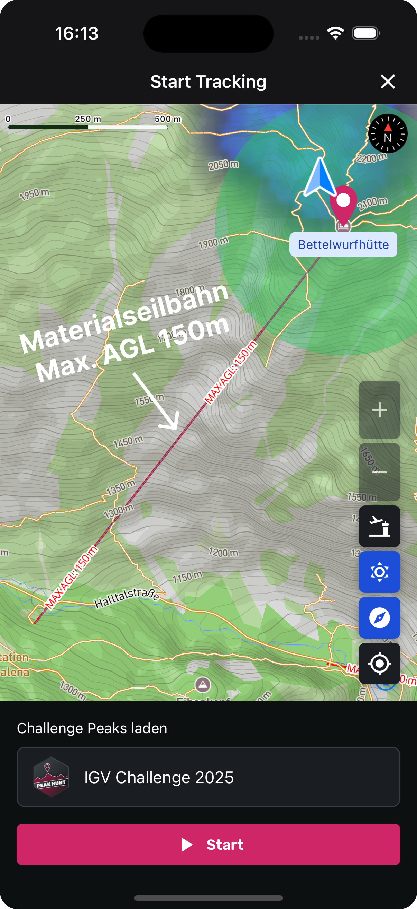

<!-- Featured image alt/description not captured; original page had a hero image. Reading time: 2 Min. Lesezeit. Updated 15. Sept. 2025 on original site. -->

"Sidekick" ist ein anderes Wort für "Wingman". Sidekik ist da, um dich bei deinen Gleitschirmabenteuern zu supporten, zu motivieren und zu leiten. Dieser Vision kommen wir heute ein ganzes Stück näher - mit dem Beta-Launch des **Hike&Fly Tracking** - direkt in der App.

## Unterstützung im Flug

Das Tracking startet mit einem Set an Funktionen, die dein Flugabenteuer und deinen Spaß bei den Peakhunt-Challenges unterstützen.

### Challenge Peaks direkt in der Map

Die Challenge-Wegpunkte (Peaks) sind direkt in der Karte sichtbar – samt Radius und automatischem Zoom, sobald du in die Nähe kommst. Dir wird die aktuelle Distanz sowie die Distanz, die du dem Peak in diesem Flug am nächsten gekommen bist, angezeigt.

### Hindernis-Anzeige in der Map

Sicherheit geht vor: In der neuen Map zeigen wir dir potenzielle Hindernisse wie Stromleitungen oder Seilbahnen an. So kannst du deine Route besser planen und auch im Flug mit einem Blick checken, was vor dir liegt. (Datenquelle: https://airspace.xcontest.org/)

### Sehen, wo's (wahrscheinlich) rauf geht

Mit der Integration der KK7-Thermikkarten siehst du auf einen Blick, wo die Aufwinde am wahrscheinlichsten sind – basierend auf echten Nutzerdaten von über drei Millionen von XC-Flügen (Datenquelle: https://thermal.kk7.ch/).

### Lufträume

Damit du während dem Flug keine Lufträume verletzt, kannst du dir die aktuellen Lufträume synchronisieren und auf der Karte anzeigen lassen. (Datenquelle: https://www.openaip.net/)

### XC-Strecke

Weil diese Funktion in anderen iOS Apps für's Fliegen fehlt, und mich persönlich in der Luft immer motiviert hat (wenn ich XCTrack verwendet habe), ist sie gleich von Beginn an mit dabei. Alle 30 Sekunden wird die aktuelle XC Strecke (inkl. Anzeige ob freie Strecke, flaches oder FAI-Dreieck) berechnet und angezeigt. Aus Batteriespargründen kann es zu leichten Abweichungen zu der Berechnung von XContest kommen.

## Außerdem

**Privacy**

Du brauchst der Sidekik App lediglich "während der Nutzung" Zugriff auf deine Standortdaten geben. Wir machen nichts im Hintergrund - ist die App geschlossen, ist sie auch wirklich geschlossen.

**Offline-Modus**

Wenn du beim Beenden deines Tracks keine Internetverbindung hast, wird der Flug lokal am Gerät zwischengespeichert. Beim nächsten Verbinden wird der Flug automatisch synchronisiert.

## Was auf der Roadmap steht

- Verbesserung und Stabilisierung der Tracking Funktionalität
- Vollständiger Offline-Modus (Vorladen von Karten und Challenges)
- IGC Export von signierten igc Dateien (upload zu XContest/DHV XC)
- "Thermik-Assistent" und Wind-Berechnung
- Live Windwerte
- Livetracking
- Routenplanung direkt in der App

Wenn du Ideen hast, oder dir wichtige Funktionen in anderen Apps fehlt, dann melde dich gerne bei mir (hi@sidekik.cloud).
